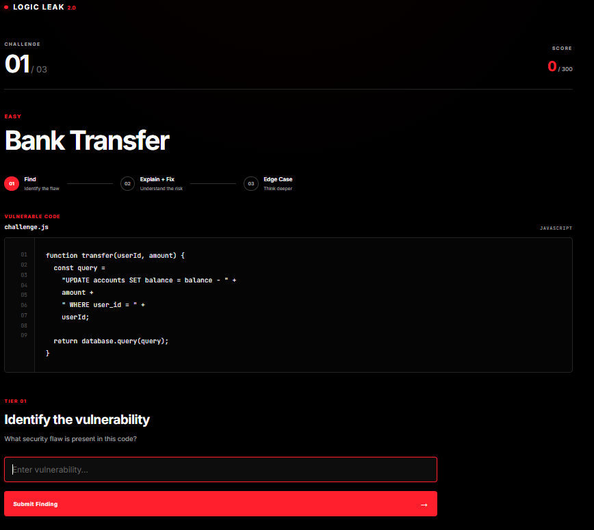
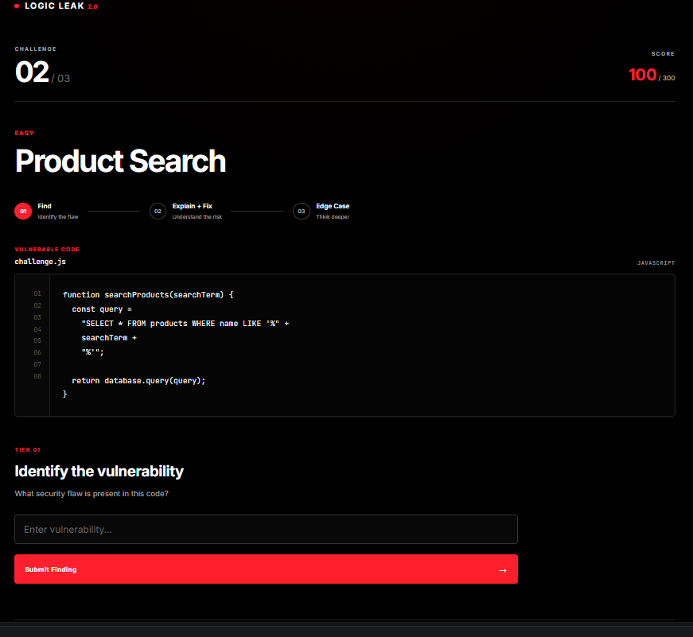
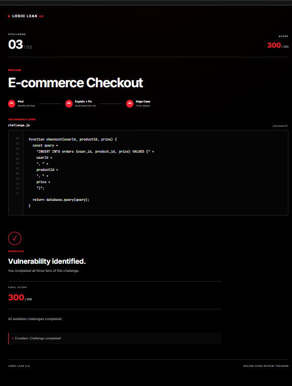

# Logic Leak 2.0

> **Can You Spot the Leak?**

Logic Leak 2.0 is an interactive cybersecurity learning platform focused on secure code review, vulnerability identification, and understanding how security flaws can be prevented.

Users analyze vulnerable code, identify the security flaw, explain why it exists, propose a secure fix, and handle an edge case.

## Features

- Vulnerability identification
- Vulnerability explanation and secure-fix reasoning
- Edge-case and boundary-condition challenges
- Sequential challenge progression
- Answer validation
- XP-based scoring
- Protected user progress
- Authentication and authorization
- API-based challenge data
- Loading and error handling
- Completion and progress tracking

## Challenge Structure

Each challenge contains three tiers:

| Tier | Task | Points |
|---|---|---:|
| Tier 1 | Identify the vulnerability | 30 |
| Tier 2 | Explain the vulnerability and secure fix | 30 |
| Tier 3 | Solve the edge case | 40 |
| **Total** | **Per challenge** | **100** |

There are currently 3 challenges, giving a maximum score of **300 XP**.

## Security Engineering

Security was treated as part of the application design rather than as a final testing step.

The project includes:

- JWT-based authentication
- Protected API endpoints
- Server-side user identity reconstruction
- User existence checks
- Cross-user authorization testing
- Challenge progression enforcement
- Input validation
- Invalid challenge and tier handling
- Duplicate reward prevention
- Wrong-answer handling
- Malformed JSON handling
- Global API error handling
- Authentication failure handling
- Security regression testing

### Authentication

Protected endpoints require a valid authentication token.

The backend does not rely only on client-supplied identity information. The authenticated user is reconstructed and validated on the server before protected operations are performed.

### Authorization

User progress is scoped to the authenticated user.

Cross-user access attempts were tested to verify that one user cannot access another user's progress.

### Business Logic Security

Challenge progression and reward logic are enforced server-side.

Testing included attempts involving:

- Skipping required challenges
- Invalid challenge IDs
- Invalid tiers
- Repeating completed tiers
- Manipulating reward conditions
- Submitting incorrect answers

### Regression Testing

After implementing security controls, the application was tested again as an integrated system.

Regression testing covered:

- Authentication
- Authorization
- Challenge progression
- Input validation
- XP and reward handling
- Duplicate reward prevention
- Malformed JSON
- Fresh-user challenge flow

The purpose was to verify that previously implemented security fixes continued to work together.

## Security Documentation

Security testing and implementation evidence is maintained in the `docs/` directory.

The documentation covers:

- Authentication
- Authorization hardening
- API hardening
- Input validation
- Business logic testing
- Security regression testing

## Screenshots

### Landing Page



### Challenge Interface



### Completion Screen



## Tech Stack

### Frontend

- React
- Vite
- JavaScript
- CSS

### Backend

- Node.js
- Express
- REST API

### Database

- SQLite

### Security

- JWT
- bcrypt
- Server-side validation
- Authorization checks

### Development

- Git
- GitHub
- PowerShell

## Project Structure

```text
logic-leak-v2/
|
├── frontend/
│   └── src/
│
├── backend/
│   ├── server.js
│   ├── challenges.js
│   └── database.js
│
├── docs/
│   ├── day10/
│   ├── day11/
│   ├── day12/
│   ├── day14/
│   ├── day15/
│   ├── architecture.md
│   ├── challenge-design.md
│   ├── Day-13-authentication.md
│   ├── day16-security-regression.md
│   ├── requirements.md
│   └── roadmap.md
│
├── Screenshots/
│
├── .gitignore
├── package.json
└── README.md
